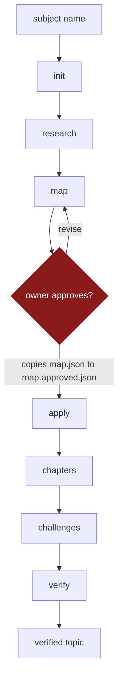

# How the repo works

Terms used here are defined in [GLOSSARY.md](GLOSSARY.md), and the reasoning behind the
ones that need it is in [CONCEPTS.md](CONCEPTS.md).

## The shape of it

Two layers. The first is a machine, the second is what the machine produced.

```
the Forge (Layer 1)                    a topic instance (Layer 2)

contract/   the spec + fixture         topics/<slug>/
tools/      validator, CLI, hooks        chapters/    prose with citation markers
.claude/    skills, agents, rules        quizzes/     questions, and hidden keys
                                         challenges/  briefs, rubrics, hidden evals
subject-agnostic                         sources.json every quote, pinned
                                         .claude/     its own Teacher, Helper, Judge

                                        generated, never hand-authored
```

## The pipeline



One stage per invocation, because a twelve-chapter topic does not fit in one context. Every
stage leaves what the next one needs on disk, so `npm run forge -- status <slug>` can pick a
run up cold after a dead session.

| stage | who does the work | what it leaves behind |
|---|---|---|
| `init` | the CLI | the directory tree |
| `research` | research subagents, three at a time | one file per shard, merged into `sources.json` |
| `map` | the model, then a person | `map.json`, and a request for approval |
| `apply` | the CLI | the whole tree projected from the approved map, stubs for everything an author owes |
| `chapters` | chapter-writing subagents | chapter prose, quizzes, and hidden answer keys |
| `challenges` | challenge-authoring subagents | briefs, rubrics, starters, hidden evaluation sets, reference solutions |
| `verify` | the auditor and the critic, then the CLI | rulings per chapter, and a stamped audit block |

Only `research` reaches the web. That single fact carries most of the citation guarantee: the
chapter writer has no fetch or search tools, so the ordinary route to an unsourced claim is
closed by the harness rather than by instruction. The excerpt has to already be in
`sources.json`.

## Forging one course

**Split the subject into questions.** Not headings. A shard is a question whose answer lives
in a primary source, and its name carries a numeric prefix because source ids are handed out
in shard order. The split goes to `shards.md` before anything is spawned, so a resumed session
can tell a shard that failed from one that never started.

**Research, three agents at a time.** Each writes verbatim quotes with locators into its own
file. The cap is not caution: an earlier session burned a session limit in ten minutes with
four unbounded agents running at once. A shard is the unit of loss, and one dead agent costs
one shard.

**Merge.** `forge sources <slug>` folds every shard into one file, hands out ids, and collapses
URL spellings that name the same document. Read the summary it prints rather than the file. A
merge that finds a problem writes nothing and names the shard responsible, so `sources.json`
either does not exist or is trustworthy.

**Design the topic.** This is the map, and it is the one stage where reading everything is
correct, because an excerpt cannot be allocated without knowing what it says. Name every
concept, order the chapters by dependency, give each an outline, and allocate every excerpt to
exactly one chapter. The chapter that owns an excerpt is the chapter responsible for citing it,
which is how the contract's two-way citation rule becomes satisfiable by construction instead
of by luck.

Then stop. Write the map, check it, summarise it in prose, and ask. A wrong chapter order found
after twelve chapters exist costs twelve chapters. Found here it costs a paragraph. That is the
entire reason this stage has a gate, and the gate is a file copy the owner makes so that an
agent cannot approve its own design.

**Apply.** The CLI projects the approved map onto disk: manifests, frontmatter, quiz shells,
challenge manifests, and the three role skills stamped from templates. Every file an author
still owes carries a `forge:stub` marker. Applying again after a map revision is safe, because
plan-derived files get rewritten and authored prose does not.

**Write the chapters.** One subagent per chapter, working from the outline and the excerpts
allocated to it. Facts, not hedges. At least one citation marker per 150 words. Each chapter
gets a quiz whose answers go somewhere the Teacher cannot read.

**Build the challenges.** Each one needs a brief, a rubric with weights summing to 100, starter
code, a held-out evaluation set, and a reference solution proven to pass that set by running it.
A challenge whose reference does not clear its own thresholds is broken, and that proof is a
command rather than an assertion.

**Verify.** The validator runs first, and passing it is a precondition rather than a substitute.
Then the auditor rules every claim against the excerpt it cites, and the critic rules on whether
the chapter teaches. Neither writes its own verdict. They hand over rulings, and
`forge verify <slug>` derives the verdicts, confirms every quoted span really appears in the
excerpt it names, and stamps the audit block.

## The rules that hold throughout

**The repo teaches and grades. It never solves.** No agent writes challenge code for the
learner, and none reveals a reference solution or an evaluation set. Where the harness enforces
that rather than the wording, the harness is the guarantee and the wording only explains why.
The Helper has no write tools. The guard hook denies writes under any challenge's `work/` to
everybody, and denies reads of hidden material to everything except the two graders and the two
authoring agents.

**Structure is the CLI's, content is the model's.** If a model has to remember a convention, the
convention is in the wrong place. Never hand-author a file the CLI generates; revise the map or
the template and apply again.

**Every non-obvious claim carries a citation marker**, and the marker resolves to a quote
somebody can go read. Chapters state facts rather than hedging, which means the confidence has
to be earned before it is written. Genuinely contested material gets stated as contested with
both sides cited. Practice that nobody measured gets the `allow-hedge` escape, which requires
naming who recommends it and saying outright that no measurement is attached.

**It reads like a person wrote it.** Everything a learner sees is held to the prose standard:
chapters, quiz questions, briefs, rubrics, and what the three roles say. Three tells are checked
mechanically and the rest is the critic's call. Material that reads as machine output gets
skimmed, and skimmed material does not teach.

The line runs between building the Forge and using it. Conversation about the repo, including
reporting on a generation run, follows whatever register the owner set. Anything a learner reads
is a deliverable and follows the prose standard regardless.

**Context cost is designed, not discovered.** `CLAUDE.md` loads in full every session, so it
stays short and imports nothing. Narrow rules live in `.claude/rules/` behind a `paths:` glob and
cost nothing until a matching file is touched. Anything that reads a lot of material goes to a
subagent so only its conclusion comes back. Fan-out work checkpoints after each unit.

**A topic that fails the validator is not done.** `validated` is mechanical and says nothing
about quality. `verified` belongs to the two verification agents. Neither can be set by hand,
because the validator checks that a chapter claiming `verified` carries both passing verdicts.

## What is committed

Chapters, sources, briefs, rubrics, quiz answer keys, hidden evaluation sets, and reference
solutions are all committed. They are the material, and the repo is not useful without them.

`.hidden/` is hidden from agents, not from people. Anyone reading this public repo can open an
answer key, and that is fine: the material is ordinary published knowledge and the learner owns
the repo. What the boundary buys is that deciding to look stays something the learner does
deliberately, rather than something that happens because a model was asked a leading question.

Two paths stay local. Learner progress in `topics/*/.state/` and learner attempts in
`topics/*/challenges/*/work/` are gitignored, so the one category of personal data this repo
produces stays off GitHub by default rather than by anyone remembering. Do not add either to a
commit, and do not quote their contents into a chapter, a commit message, or an issue.

## Commands

```
npm run forge -- init <slug>              create the tree
npm run forge -- status <slug>            where a topic is, what it still owes
npm run forge -- sources <slug>           merge the shards into sources.json
npm run forge -- sources <slug> --verify   re-fetch and re-check every quote
npm run forge -- check <slug>             rule on a map without applying it
npm run forge -- apply <slug>             project the approved map onto disk
npm run forge -- eval <slug> <id> --reference   prove a challenge is solvable
npm run forge -- verify <slug>            derive verdicts and stamp audit blocks
npm run forge -- promote <slug>           draft to validated, if it passes strict

npm run validate -- topics/<slug> --strict
npm run validate:all
npm test
npm run typecheck
```
